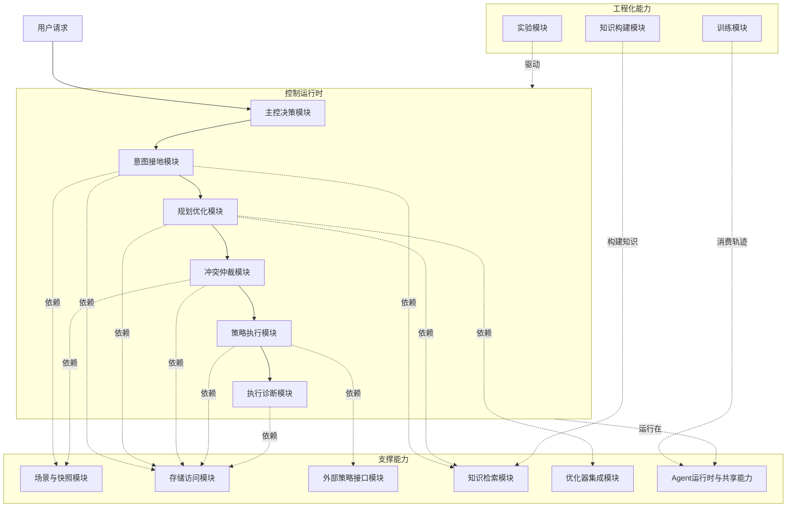
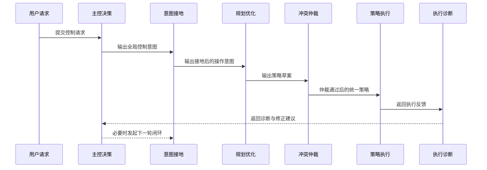
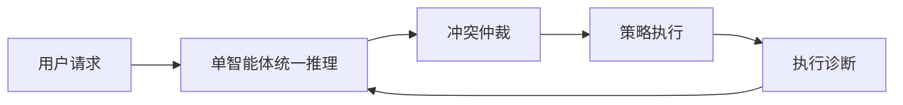
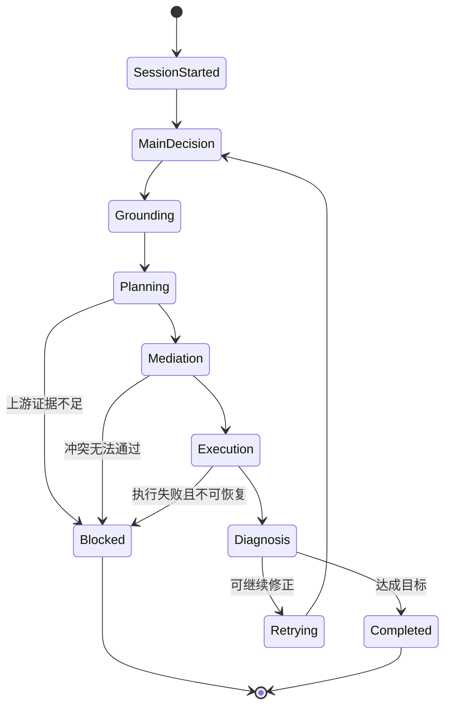
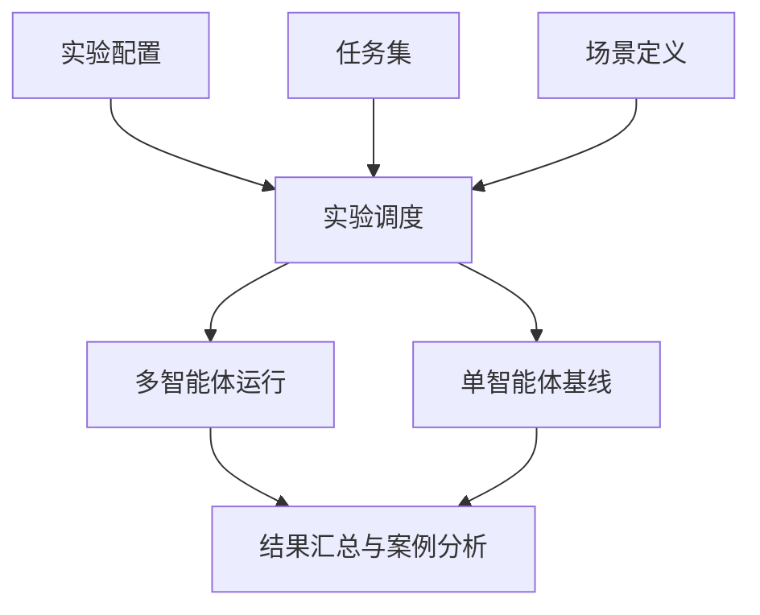
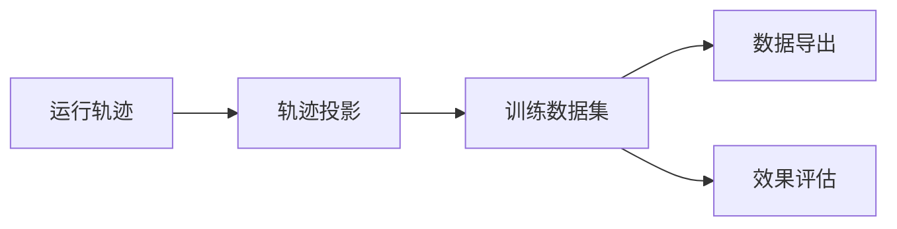

# Multiagents 技术文档

## 1. 项目定位

`Multiagents` 是一个面向 6G/5G 控制闭环的多智能体工作区，核心目标是把“用户控制请求 -> 意图理解 -> 目标接地 -> 策略规划 -> 冲突仲裁 -> 策略执行 -> 执行诊断”组织成一条可迭代、可实验、可训练的运行链路。

从当前实现来看，它已经不是单纯的重构草稿，而是一个具备实际运行能力的控制运行时工作区。同时，它也还处于重构演进阶段，因此更适合被理解为“新架构主干”，而不是整个大仓库唯一的最终形态。

## 2. 总体设计思路

项目采用分层、模块化的组织方式，尽量把控制逻辑、基础设施、知识能力、实验能力和训练能力拆开。

## 3. 模块划分

### 3.1 控制运行时模块

这是项目的核心业务层，负责把控制请求转化为可执行闭环。它不是一个单体模块，而是一组职责明确的子模块组合。

#### 3.1.1 主控决策模块

职责：

- 接收用户原始控制请求
- 判断请求涉及哪些控制域
- 确定当前轮次的主目标、重试范围和路由策略
- 为下游模块提供统一的全局控制意图

这个模块更像“总控台”，它不直接生成策略，而是负责决定后续应该调动哪些能力、先看什么、重试什么、约束什么。

#### 3.1.2 意图接地模块

职责：

- 将自然语言请求映射到可执行对象
- 识别 UE、应用、flow、移动性对象、策略目标
- 收集执行所需上下文和领域证据
- 输出具备明确操作语义的中间意图

这个模块解决的是“用户到底在说谁、改什么、约束是什么”这一层问题。它把自然语言变成后续规划器能真正处理的结构化对象。

#### 3.1.3 规划优化模块

职责：

- 基于接地后的中间意图生成策略草案
- 调用优化器或规划工具进行资源和策略求解
- 将策略拆分为 QoS 域和 Mobility 域的可执行草案
- 在证据不足时返回阻塞信息，而不是盲目生成结果

这个模块是“从理解到方案”的核心转换层。它既要满足控制语义，又要考虑资源、目标和约束的可执行性。

#### 3.1.4 冲突仲裁模块

职责：

- 在策略真正执行前做跨域一致性检查
- 发现 QoS 与 Mobility 之间的资源冲突、目标冲突和约束冲突
- 给出通过、驳回或修订建议

它相当于执行前的最后一道逻辑闸门，目的不是重新规划，而是防止明显不一致的策略直接进入执行阶段。

#### 3.1.5 策略执行模块

职责：

- 把策略草案编译成可下发形式
- 调用外部策略接口完成下发
- 获取执行结果
- 在成功后写回运行状态与上下文

这个模块负责把“计划”变成“动作”，是真正连接控制逻辑与外部网络控制面的地方。

#### 3.1.6 执行诊断模块

职责：

- 对执行失败、仲裁阻塞、SLA 不达标等情况做归因
- 给编排器提供可重试的反馈信息
- 标记受影响的策略对象和流对象

它的价值不只是报错，而是形成结构化的“为什么失败、下一轮该如何修”的反馈闭环。

## 4. 控制闭环运行逻辑

### 4.1 多智能体闭环

多智能体模式下，各模块按职责串联工作，每一轮都可以根据反馈进行下一轮修正。

### 4.2 单智能体基线

单智能体模式不是另一套后端，而是把“主控决策 + 接地 + 规划”这几个认知阶段合并为一个统一 agent，再复用相同的执行、仲裁和诊断链路。

这使得实验中可以公平比较：差异主要在前面的“理解与规划方式”，而不是后端执行面不一致。

## 5. 编排层思路

编排层负责把上面的模块组织成一个可多轮迭代的控制会话。

职责：

- 创建和维护会话标识
- 绑定网络快照
- 管理轮次状态
- 在失败后拼接反馈上下文
- 记录每轮轨迹
- 判断何时完成、何时重试、何时阻塞

可以把它理解成控制系统的“调度器 + 状态机”。

## 6. 支撑能力模块

### 6.1 场景与快照模块

职责：

- 初始化实验场景
- 提供当前或指定网络快照
- 将图快照转换为控制运行时可消费的状态
- 在实验启动前重建 UE 相关运行表

这层的核心价值是给控制运行时提供“一致、可回放、可复现实验”的数据基础。

### 6.2 存储访问模块

职责：

- 读写会话状态
- 读写 UE 上下文
- 提供 flow catalog 和语义搜索
- 读取图快照及其元数据

它在架构中的位置很重要，因为它把上层控制逻辑和底层数据库细节隔离开了。

### 6.3 外部策略接口模块

职责：

- 将内部策略对象转换为外部系统可识别的请求
- 补齐执行请求所需字段
- 完成策略下发与反馈查询

这层本质上是对外部控制面接口的适配层。

### 6.4 优化器集成模块

职责：

- 封装优化求解逻辑
- 提供 QoS / Mobility / 联合控制求解能力
- 避免控制逻辑与旧优化器实现细节直接耦合

这个模块的存在说明项目在设计上已经有“求解器后端可替换”的意识。

### 6.5 知识检索模块

职责：

- 支撑领域知识问答和条款检索
- 为接地与规划提供 3GPP/PCF 语义依据
- 融合精确检索、语义检索和 rerank

这个模块承担的是“外部知识注入”角色，避免 agent 只凭模型记忆做不稳定推断。

### 6.6 Agent运行时与共享能力

职责：

- 提供统一的运行时上下文
- 管理 artifact、queue、trace、workspace
- 提供结构化工具循环
- 提供基础 agent 封装、日志、短期记忆、工具包装器

这层不直接关心控制业务，但控制业务基本都建立在它上面。

## 7. 数据与状态模型

从当前实现看，项目内部存在三类核心状态。

### 7.1 会话状态

描述一次控制任务在运行中的推进情况，包括：

- 当前阶段
- 当前轮次
- 当前快照
- 当前错误
- 当前中间结果

### 7.2 网络与运行态

描述控制对象所在的网络世界，包括：

- 网络图快照
- 切片状态
- 节点状态
- 应用与 flow 分配
- UE 上下文
- Mobility 相关状态

### 7.3 知识与经验态

描述系统可复用的长期资源，包括：

- 语义知识
- 向量化知识条目
- 长期经验样本
- 训练轨迹

这三类状态共同支撑了“在线推理 + 离线训练 + 可回放实验”三条能力线。

## 8. 实验模块

实验模块面向“方法比较”和“场景复现”。

职责：

- 定义实验矩阵
- 组织任务集
- 生成输入
- 运行多智能体方法与单智能体基线
- 汇总实验结果

实验层与控制运行时的关系可以概括为：

实验模块的意义在于把“控制系统能跑”推进到“控制系统能比较、能统计、能复现”。

## 9. 训练模块

训练模块面向“轨迹资产化”和“模型微调数据准备”。

职责：

- 采集运行轨迹
- 将运行轨迹投影成训练样本
- 导出为训练格式
- 评估 agent 和 workflow 质量

它的设计思路是按 agent 和 workflow 双视角组织，而不是只保留最终答案。这一点很重要，因为这意味着项目不仅关注结果，也关注中间决策质量。

## 10. 知识构建模块

知识构建模块面向“知识底座生产”。

职责：

- 从规范与资料中抽取领域知识
- 建立 clause/schema 级知识结构
- 迁移到向量库
- 评估检索质量

这部分虽然不在控制主链路中直接出现，但它决定了知识检索模块是否可靠，因此是整个系统稳定性的隐性基础设施。

## 11. 项目当前架构特征

从代码现状看，这个项目有几个很鲜明的架构特征。

### 11.1 控制主链路已经清晰

系统主干已经稳定为：

- 主控判断
- 意图接地
- 策略规划
- 冲突仲裁
- 策略执行
- 执行诊断

这条链路已经足够清楚，后续继续扩展时应尽量沿着这条主线补能力，而不是再引入模糊边界。

### 11.2 运行时基础设施正在收口

控制逻辑、共享能力、Agent运行时已经开始分层，说明项目在从“功能能跑”走向“边界清晰、模块可替换”。

### 11.3 实验与训练已经和主系统打通

这不是一个只有在线推理的系统，它已经具备：

- 实验复现能力
- 轨迹沉淀能力
- 离线训练准备能力

这三者打通后，系统具备持续演进空间。

### 11.4 仍处于重构过渡期

需要直接指出一点：当前工作区虽然已经成形，但仍带有迁移中的痕迹。也就是说，架构方向已经明确，但边界清理和旧实现收尾还没有完全结束。

## 12. 建议的阅读顺序

如果后续要给团队成员或论文读者阅读，建议按下面顺序理解：

1. 先看总体架构图，理解分层
2. 再看控制闭环图，理解主链路
3. 再看支撑能力模块，理解数据和外部依赖
4. 最后看实验、训练和知识构建，理解工程化闭环

## 13. 后续文档建议

这份文档适合作为“总览文档”。如果后续继续完善，建议再拆三份专题文档：

- 控制闭环时序文档
- 数据与状态模型文档
- 实验与训练流水线文档

这样结构会比在一份总文档里不断追加细节更清楚。
