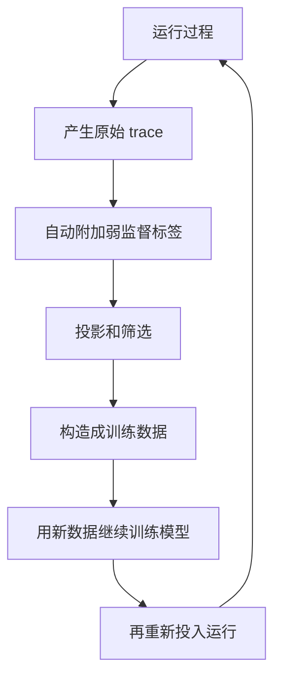

# 自治闭环系统创新点与灵活性

1. 重新判断当前系统的创新点应该往哪个方向走
2. 判断核心网业务流程到底哪些可以灵活配置，哪些不能
3. 在此基础上，整理一个可以持续产出 trace 和训练数据的自治闭环系统设计思路

## 一、创新点思考

现有系统虽然已经具备了多智能体协作、策略生成、策略执行、结果反馈这些能力，但整体上仍然是**用户触发一次，系统运行一次**，还没有形成真正持续运行的自治闭环。

所以后续创新点更合适的方向是：

1. **从用户输入驱动，转向意图持续保障驱动**
2. **从一次性执行流程，转向可持续运行的自治闭环**
3. **从离线构建数据集，转向系统运行过程中自动生成训练数据**

### 创新点一：从一次性控制流程，转向自治闭环系统

这个创新点的核心是把用户输入逐步沉淀为**长期生效的结构化意图约束**。

真正应该保留的不是原始文本，而是从文本中抽取出来、能够约束系统长期运行的意图标准，比如：

1. 用户要保障的对象
2. 优先级关系
5. 对应到系统里是哪些业务指标、资源指标或策略对象

系统首先将用户输入转化为结构化意图契约，后续所有智能体执行、运行监控、偏差检测和重规划，都围绕这个意图契约展开，而不是围绕单次自然语言输入展开。

### 创新点二：在线自动化数据集构建

如果系统形成了自治闭环，那么它的运行过程本身就会持续产生大量 trace。一旦系统开始持续运行，就会不断经历下面这些过程：

1. 用户输入被转换为结构化意图
2. 系统生成候选策略
3. 策略被执行到运行环境中
4. 系统持续**监控**业务是否满足目标
5. 一旦发现偏差，系统重新触发闭环规划
6. 多轮修订后，系统要么满足目标，要么输出失败原因

这整条链路本身就会产生大量高价值数据，包括：

1. 意图解析 trace
2. 规划 trace
3. 工具调用 trace
5. 监控告警 trace
7. 最终成功 / 失败 trace

自治闭环系统先持续产生原始 trace；然后再根据执行是否成功、SLA 是否满足、重入原因、冲突类型、最终保障结果等信息，为 trace 自动附加标签；最后经过筛选、分层采样和质量评估，把这些运行 trace 转化为可用于训练的数据集。

## 二、核心网业务流程灵活性

### 1. 不能随意改写的部分

核心网中的基础控制过程，本身受 3GPP 标准化流程约束较强，例如注册、鉴权、PDU Session 建立、策略关联、移动性管理等基础信令过程，都不是可以由大模型自由改写的内容。其主要原因在于：

1. **基础信令流程本身是标准约束的**
   核心网中的关键控制流程已经由标准规定了基本消息交互过程和功能关系。
2. **流程中的消息交互顺序、功能角色和关键对象绑定不能随意改变**
   例如 UE、AMF、SMF、PCF、UPF 等网元在控制面中的职责边界和交互关系是固定的，不能由模型临时生成一套新的底层流程。
3. **大模型更不适合直接承担高风险、强一致性的底层执行控制**
   基础控制流程要求可验证、可审计、可回滚，而大模型输出存在幻觉和不稳定性，因此不能直接作为无约束的底层控制器。

因此，核心网其灵活性并不体现在底层标准过程本身，而体现在这些标准过程之上的策略和编排层。

------

### 2. 可以灵活配置的部分

当前核心网中真正具备灵活配置能力的部分，主要集中在以下几层：

1. **业务驱动的切片定制层**
2. **策略生成与调整层**
3. **分析驱动的闭环优化层**
4. **网元部署与资源编排层**
5. **意图驱动的管理与自治决策层**

------

### 3. 当前项目中大模型承担的灵活配置层任务

从当前项目的设计思路来看，大模型承担主要是核心网上层可灵活配置的那一部分任务。

大模型适合承担这些任务，主要是因为这类任务具有以下共同特点：

1. 语义强
2. 上下文依赖强
3. 难以完全用固定规则写死
4. 需要跨步骤理解和组合

结合当前项目，大模型实际承担的任务主要包括：

1. 意图到策略目标的翻译
2. QoS / SLA 参数候选生成
3. 切片选择和业务优先级调整
4. 资源冲突时的重分配建议
5. 基于监控结果的局部修订和全局重规划
6. 多域策略之间的冲突识别与顺序编排

当前项目中大模型作为核心网**上层自治编排与策略生成能力**的一部分存在，在标准流程边界内，提高意图理解、策略生成、冲突处理和闭环调控的智能化程度。

## 三、自治闭环系统的详细设计思路

整个系统后续可以拆成四层。

1. 目标层
2. 执行层
3. 保障监控层
4. 自动化数据采集层

### 一、目标层（需改进）

目标层负责把用户输入沉淀成长期可维护的结构化意图约束。

这一层建议至少维护下面这些内容：

1. 目标对象：用户、业务流、会话、切片、区域
2. 指标目标：时延、抖动、吞吐、可靠性、优先级、公平性
3. 约束强度：必须满足、尽量满足、允许牺牲
4. 生效时间：即时、阶段性、长期
5. 冲突规则：新意图与旧意图如何覆盖，谁优先
6. 监控映射：每个意图最终对应哪些可观测指标

这一层最关键的是意图生命周期规则。

如果没有生命周期规则，历史意图会越积越多，最后系统既不知道该优先保障谁，也不知道哪条旧意图已经失效。

### 二、执行层（已存在）

执行层负责围绕当前意图约束生成策略、执行策略，并在失败后支持重新进入流程。

当前执行层中各部分的职责可以概括为：

1. **主智能体**负责接收用户输入，判断当前控制请求的大致目标，并组织后续流程推进
2. **意图解析智能体**负责将用户输入转化为结构化目标、约束和控制对象
3. **策略生成智能体**负责根据意图结果和当前状态生成候选策略
4. **策略执行与反馈环节**负责下发策略、检查执行结果，并根据结果决定流程结束还是重新进入前序环节

执行层仍然保持当前项目已经实现的主结构

### 三、保障监控层（需新增）

如果系统只有执行，没有持续监控，那么它本质上还是多智能体流水线，而不是自治闭环系统。

这一层需要持续完成下面几件事：

1. 采集业务运行指标
2. 采集资源状态和策略状态
3. 把这些状态映射回目标层中的意图约束
4. 判断当前是暂时波动还是持续违约
5. 一旦违约，生成结构化重入事件
6. 把这个事件送回执行层重新规划

这个重入事件中，至少包含：

1. 哪个对象违约
2. 哪个指标违约
3. 偏差幅度有多大
4. 可能原因是什么（或者说当前调整建议是什么）
5. 哪些既有约束必须保留

这样系统的触发源就不再只有用户，还包括环境变化造成的意图偏差修正事件。

### 四、自动化数据采集层（需改进）

自动化数据采集层负责把整个自治闭环过程转化成可以继续训练系统的数据：

1. 意图 trace
2. 规划 trace
3. 执行 trace
4. 监控 trace
5. 重入 / 恢复 trace

然后再基于这些 trace 自动附加标签，例如：

1. 结果标签：最终是否满足意图
4. 代价标签：耗时、轮次、资源扰动范围
5. 学习标签：哪些片段适合拿去做监督微调，哪些更适合做偏好优化

最终形成一条完整的数据链路：

